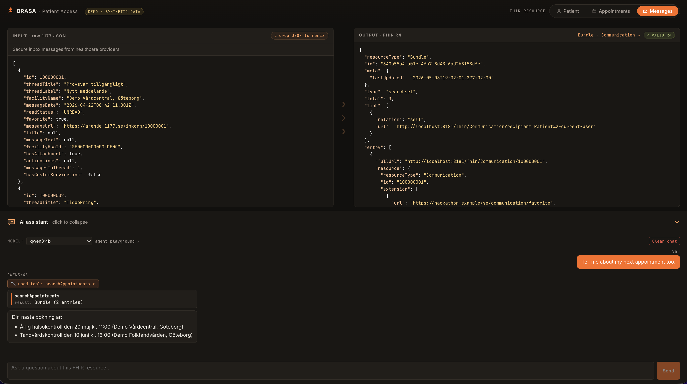

# Vitalis HL7 Hackathon 2026 — Agentic Patient Access



A FHIR R4 facade over the non-FHIR Swedish health portal **1177.se**, plus a
Mastra agent and a side-by-side viewer GUI.

> Project name: **Brasa** (Swedish for *bonfire*) — FHIR sounds like *fire*,
> and the dark/orange palette nods to Claude's flame.

## What's in this repo

| Path | What |
|---|---|
| `fhir-proxy/` | Java 17 + Spring Boot + HAPI FHIR R4 facade. Builds `target/fhir-proxy-1177.jar`. |
| `fhir-proxy/ui/` | Vite + React side-by-side viewer (raw 1177 JSON ↔ FHIR R4 output). Bundled into the jar via `mvn package`. |
| `agent/` | Mastra (TypeScript) agent that talks FHIR to the proxy. Has eval harness. |
| `scripts/sanitize-har.mjs` | Sanitizer (`raw → clean`). |
| `scripts/make-demo-har.mjs` | Demo synthesizer (`clean → demo`). |
| `data/raw/` | Captures with real PII. **gitignored**, never share. |
| `data/clean/` | `1177-clean.har` (sanitized) + `1177-demo.har` (synthetic Test Testsson). |
| `data/examples/` | Alternate "Anna Andersson" identity — used for the GUI's drag-and-drop demo of `POST /transform/Patient`. Drop one of these JSON files onto the input panel to re-run the mappers against a different identity. |
| `data/fhir/` | Snapshots of converted FHIR resources (output destination). |
| `doc/finding.md` | Endpoint inventory + 1177→FHIR R4 mapping tables. |
| `doc/DEMO.md` | 5-minute presentation runbook. |
| `package.json` | Root orchestrator — `npm run dev` runs proxy + agent + Vite together. |

## How it works

```
mitmproxy capture → sanitize-har.mjs → fixtures (or live HTTP)
                                            ↓
                                    UpstreamSource (Java)
                                            ↓
                                    Mapper  (pure, JsonNode → FHIR R4)
                                            ↓
                                    IResourceProvider (HAPI)
                                            ↓
                                    /fhir/* REST surface
                                            ↓
                                    Mastra agent + GUI
```

`UpstreamSource` is the only seam between FHIR and 1177 — swap fixtures for live
HTTP without touching the mappers. Mappers are pure and defensive (every field
null-checked). Providers stay thin — fetch, hand to a mapper, return.

## Quick start

```bash
# one-time: install JS deps for UI + agent
npm run install:all

# run everything (Java proxy on :8181, agent, Vite dev server) in one terminal
npm run dev
```

- Proxy + GUI: `http://localhost:8181/`
- FHIR endpoints: `http://localhost:8181/fhir/...`
- Vite UI dev server (hot reload): `http://localhost:5173/`

Proxy-only (no agent, no Vite — uses the bundled UI in the jar):

```bash
cd fhir-proxy
mvn -DskipTests package          # also builds the React GUI into src/main/resources/static/
java -jar target/fhir-proxy-1177.jar
# in another shell:
curl -s http://localhost:8181/fhir/Patient/current-user | jq
curl -s 'http://localhost:8181/fhir/Communication?recipient=Patient/current-user' | jq
```

> The Vite bundle under `fhir-proxy/src/main/resources/static/` is treated as a
> build artifact (gitignored). `mvn package` regenerates it via
> `frontend-maven-plugin`. On a fresh clone you must run `mvn package` (or
> `cd fhir-proxy/ui && npm install && npm run build`) before `java -jar` will
> serve the GUI; the FHIR endpoints work without the bundle.

Live mode (forwards a real 1177 session cookie upstream):

```bash
PROXY_MODE=live PROXY_COOKIE='<raw Cookie header from a logged-in 1177 session>' \
  java -jar fhir-proxy/target/fhir-proxy-1177.jar
```

Validation tests + agent evals:

```bash
cd fhir-proxy && mvn test     # HAPI R4 instance validator on every mapper output
npm run eval                  # Mastra agent evals
```

## End-to-end pipeline

1. **Capture** — `mitmweb` + Chrome with `--proxy-server`, log in with BankID.
2. **Export** — `mitmdump -nr data/raw/1177-raw-mitproxy --set hardump=data/raw/1177-raw.har`.
3. **Sanitize** — `KNOWN_PII="<your name fragments>" node scripts/sanitize-har.mjs data/raw/1177-raw.har data/clean/1177-clean.har`.
4. **Demo HAR** — `node scripts/make-demo-har.mjs` (rewrites placeholders into synthetic Test Testsson, injects demo appointments).
5. **Map** — read `doc/finding.md` for endpoint→resource mapping.
6. **Run** — `npm run dev` (or `java -jar fhir-proxy/target/fhir-proxy-1177.jar` for proxy-only).
7. **Validate** — `cd fhir-proxy && mvn test`.
8. **Snapshot output** — e.g. `curl -s http://localhost:8181/fhir/Patient/current-user > data/fhir/Patient-current-user.json`.
9. **Demo it** — follow `doc/DEMO.md`.

## Hackathon task status

| Task | Status | Where |
|---|---|---|
| 1. Explore — capture + sanitize HAR | ✅ done | `data/clean/1177-clean.har` |
| 2. Map endpoints to FHIR resources | ✅ done | `doc/finding.md` |
| 3. Build proxy (Patient, Appointment, Communication) | ✅ done | `fhir-proxy/` |
| 4. Validate FHIR output | ✅ done | `fhir-proxy/src/test/java/.../FhirValidationTest.java` |
| 5. README | ✅ done | this file + `fhir-proxy/README.md` |
| 6. Demo runbook + synthetic HAR | ✅ done | `doc/DEMO.md` + `data/clean/1177-demo.har` |
| 7. GUI (raw ↔ FHIR side-by-side) | ✅ done | bundled at `http://localhost:8181/` |
| 8. Agentic client + evals | ✅ done | `agent/` |

## Sanitization hygiene

Before re-running the sanitizer with new captures, update the `KNOWN_PII` env
var with your real-name fragments (e.g. `Firstname,Lastname,Lastname-without-diacritics`).
The script also catches:

- Personnummer regex `\b(19|20)?\d{6}[-+]?\d{4}\b`
- Email regex
- Swedish phone regex
- All cookie values (`Cookie`, `Set-Cookie`)
- `Authorization`, `X-Auth-Token`, `X-Csrf-Token`
- Bearer tokens, JWTs (`eyJ…`)
- All UUIDs (replaced with zeros)
- Well-known PII JSON keys: `firstName`, `lastName`, `personId`, `personName`,
  `email`, `phone`, `address`, `city`, `zip`, `dateOfBirth`, etc.

Verify with grep before sharing:

```bash
grep -ciE 'firstname|lastname' data/clean/1177-clean.har                   # should be 0
grep -coE '\b(19|20)?[0-9]{6}[-+]?[0-9]{4}\b' data/clean/1177-clean.har    # should be 0
```

`data/raw/` is gitignored — `*.raw.har` anywhere in the tree is also blocked
as defence-in-depth.

## Reproducing the capture

```bash
# start mitmweb
mitmweb --listen-port 8082 --set confdir=~/.mitmproxy

# launch Chrome through the proxy (port 8080 was held by a Java process)
open -na "Google Chrome" --args \
  --user-data-dir=/tmp/mitm-chrome \
  --proxy-server="http=127.0.0.1:8082;https=127.0.0.1:8082" \
  --ignore-certificate-errors

# log into 1177.se with BankID, click around, then export
mitmdump -nr data/raw/1177-raw-mitproxy --set hardump=data/raw/1177-raw.har
```

## Track guide

[Vitalis Hackathon 2026 — Agentic Patient Access](https://hl7.se/fhir/vitalis-hackathon-2026/track-agentic-patient-access.html)